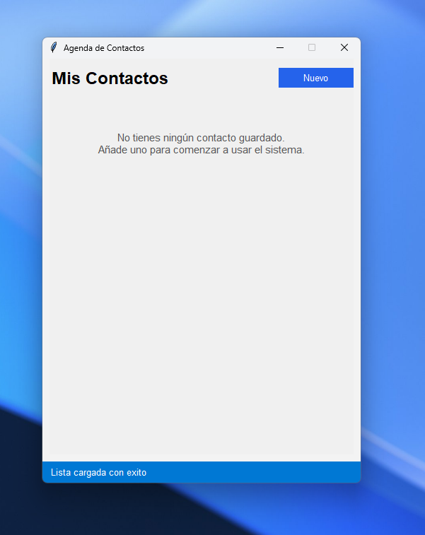
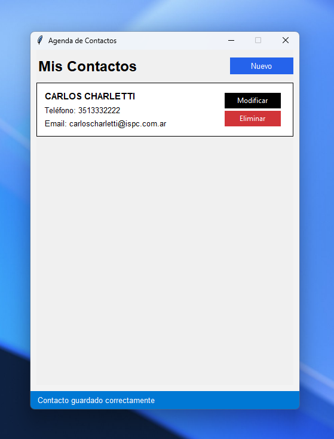
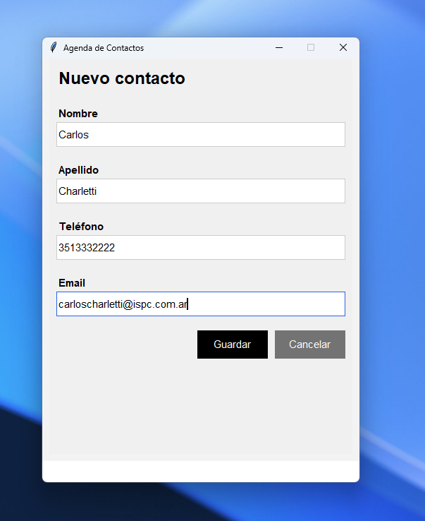
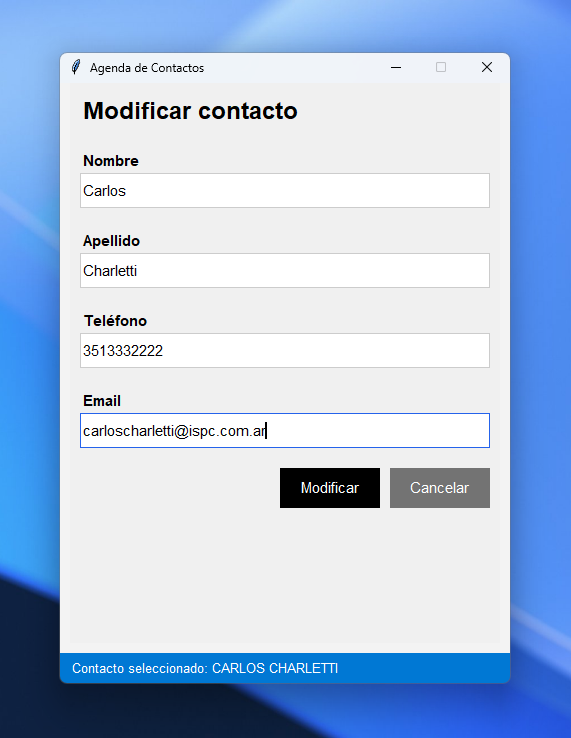
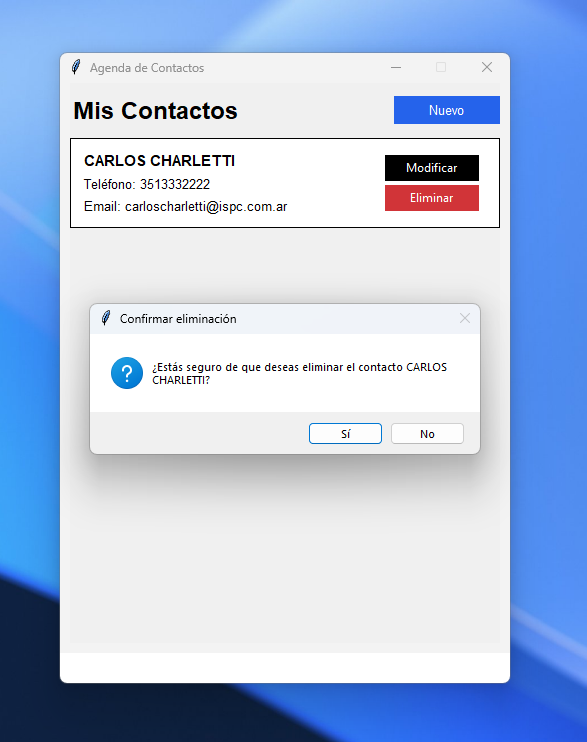

# Agenda de Contactos

Aplicación de escritorio desarrollada en Python con interfaz gráfica (Tkinter), orientada a la gestión de contactos personales. El proyecto está diseñado con enfoque pedagógico, aplicando principios de **Programación Orientada a Objetos (POO)** y persistencia de datos mediante una **base de datos local SQLite**.

---

## Objetivo del proyecto

Este programa tiene como finalidad mostrar de forma clara y funcional cómo se estructura una aplicación real utilizando POO, separación de responsabilidades, y almacenamiento persistente. Está pensado para ser fácilmente entendible, modificable y útil como base para proyectos educativos o personales.

---

## Principios aplicados

- **POO (Programación Orientada a Objetos)**  
  Cada contacto es una instancia de una clase `Contacto`, con métodos propios para guardar, actualizar y eliminar. La lógica de datos está encapsulada y separada de la interfaz.

- **Separación de responsabilidades**  
  La interfaz (`InterfazAgenda`) se encarga de la presentación y la interacción con el usuario, mientras que la clase `Contacto` gestiona la lógica de base de datos.

- **Persistencia con SQLite**  
  Los datos se almacenan localmente en una base de datos `.db`, permitiendo conservar la información entre sesiones.

---

## Visualización

A continuación se muestran capturas del programa en funcionamiento:

### Vista principal

---

### Creación de nuevo contacto

---

### Edición de contacto

---

### Eliminación de contacto

---

## Cómo funciona

1. **Inicio**  
   Al abrir la aplicación, se muestra la lista de contactos almacenados en la base de datos.

2. **Nuevo contacto**  
   Al presionar el botón “Nuevo”, se despliega un formulario completo para ingresar los datos. Al guardar, se crea una nueva entrada en la base de datos.

3. **Modificar contacto**  
   Cada contacto tiene un botón “Modificar” que carga sus datos en el formulario. Al actualizar, se modifica la entrada existente.

4. **Eliminar contacto**  
   El botón “Eliminar” borra el contacto de forma permanente de la base de datos.

5. **Cancelación**  
   El botón “Cancelar” cierra el formulario y vuelve a la vista principal sin guardar cambios.

---

## Estructura del código

- `main.py` → Punto de entrada del programa
- `gui.py` → Clase `InterfazAgenda`, contiene la lógica de la interfaz gráfica
- `contacto.py` → Clase `Contacto`, gestiona la lógica de base de datos
- `database.db` → Base de datos SQLite con tabla de contactos

---

## Requisitos

- Python 3.10+
- Tkinter (incluido por defecto en la mayoría de instalaciones de Python)
- No requiere conexión a internet ni instalación de paquetes externos

---
